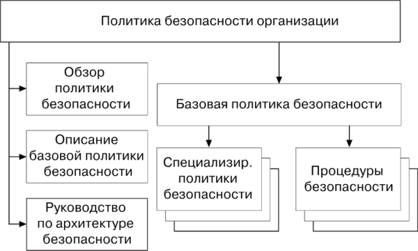

---
## Front matter
lang: ru-RU
title: Методы организации безопасности в операционных системах
subtitle: 
author:
  - Мазуркевич А Д
  - Преподаватель: Кулябов Дмитрий Сергеевич - профессор кафедры прикладной информатики и теории вероятностей
institute:
  - Российский университет дружбы народов, Москва, Россия

## i18n babel
babel-lang: russian
babel-otherlangs: english

## Formatting pdf
toc: false
toc-title: Содержание
slide_level: 2
aspectratio: 169
section-titles: true
theme: metropolis
header-includes:
 - \metroset{progressbar=frametitle,sectionpage=progressbar,numbering=fraction}
---

# Информация

## Преподаватель

:::::::::::::: {.columns align=center}
::: {.column width="70%"}

  * Кулябов Дмитрий Сергеевич
  * д.ф.-м.н., профессор
  * профессор кафедры прикладной информатики и теории вероятностей
  * Российский университет дружбы народов
  * [kulyabov-ds@rudn.ru](mailto:kulyabov-ds@rudn.ru)
  * <https://yamadharma.github.io/ru/>

:::
::: {.column width="30%"}

## Докладчик

:::::::::::::: {.columns align=center}
::: {.column width="70%"}

  * Мазуркевич Анастасия
  * студент НПИбд-02-24
  * Российский университет дружбы народов

:::
::: {.column width="30%"}

:::
::::::::::::::

# Вводная часть

## Актуальность

- Защита операционных систем

## Объект и предмет исследования

- Операционные системы и безопасность в них

## Цели и задачи

- Изучить методы организации безопасности в ОС

## Материалы и методы

- Операционные системы

# Методы организации безопасности в операционных системах

## Ведение

Методы организации безопасности в операционных системах направлены на защиту информации, предотвращение несанкционированного доступа и обеспечение целостности данных. В данной работе рассматриваются основные подходы и технологии, используемые для обеспечения безопасности в ОС, такие как контроль доступа, шифрование данных, а также механизмы аутентификации и авторизации пользователей.

## Аутентификация и авторизация

## Шифрование данных

## Защита от вредоносного ПО

## Мониторинг безопасности

## Политика безопасности

## Заключение

Методы организации безопасности в операционных системах являются многоуровневыми и требуют комплексного подхода. Аутентификация, шифрование, защита от вредоносного ПО, мониторинг и аудит, а также разработка политик безопасности — все эти элементы играют важную роль в обеспечении защиты информации. В условиях постоянно меняющихся угроз важно постоянно обновлять и адаптировать методы безопасности, чтобы минимизировать риски и защитить данные пользователей и организаций.

