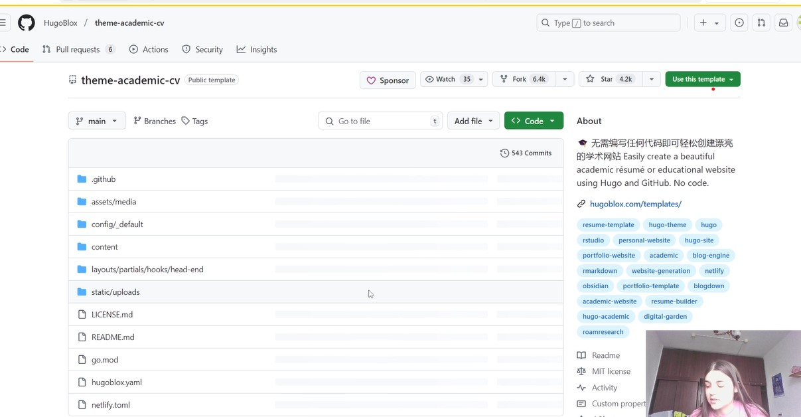
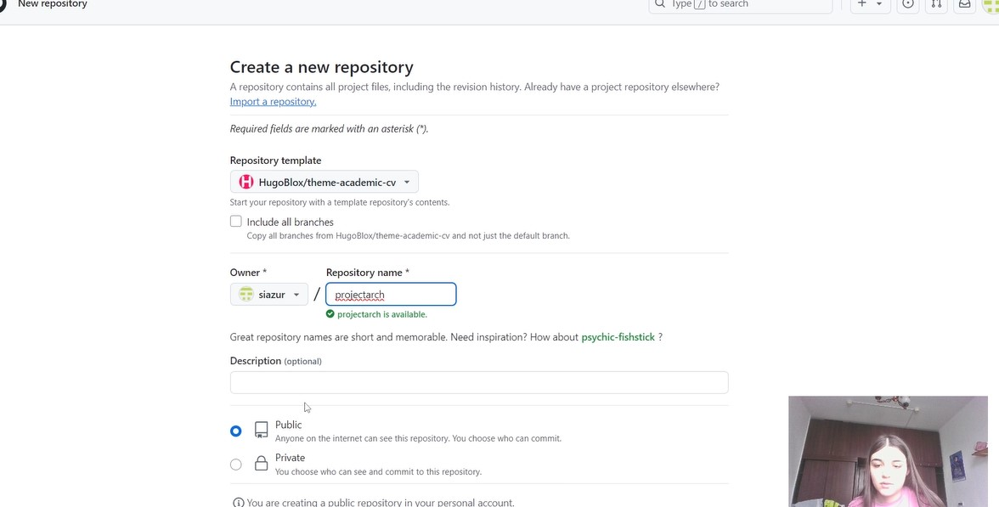
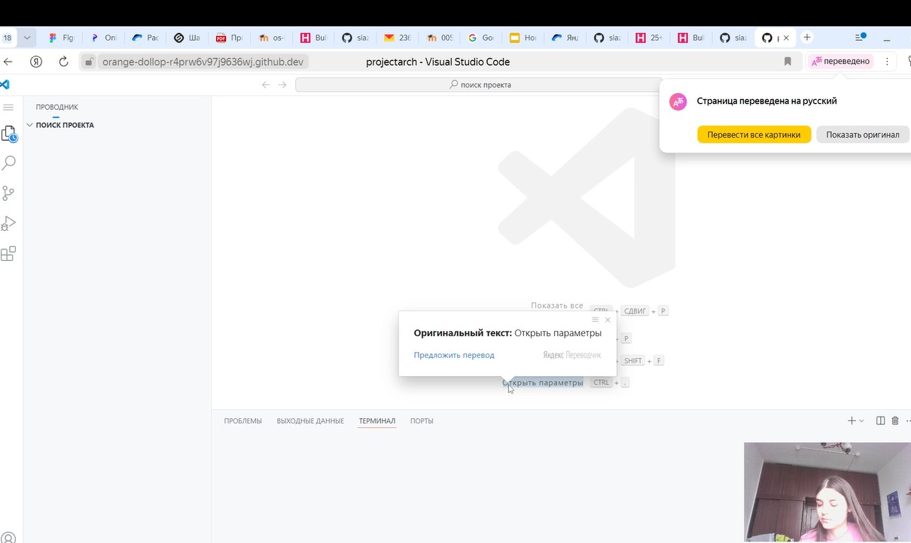
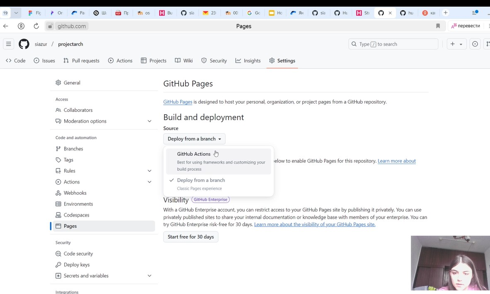
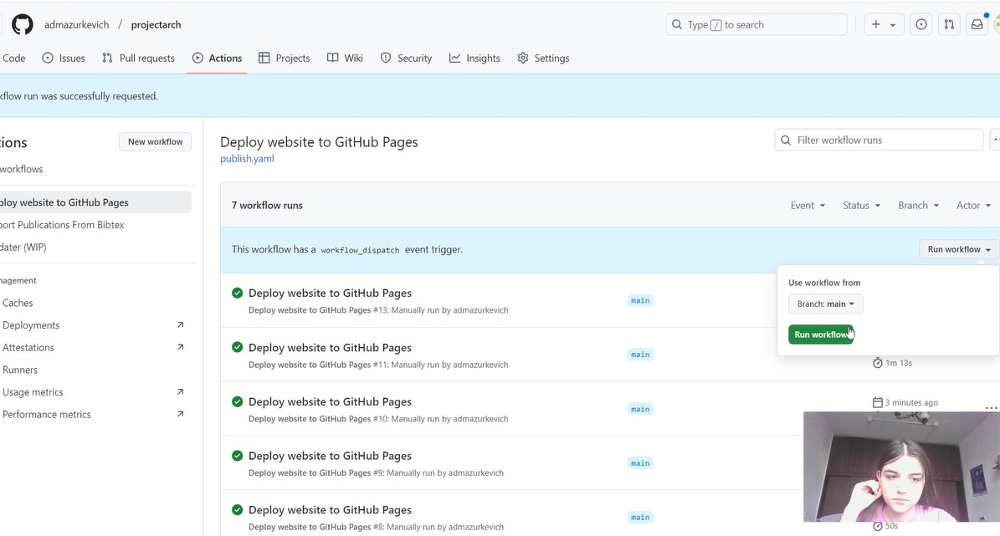
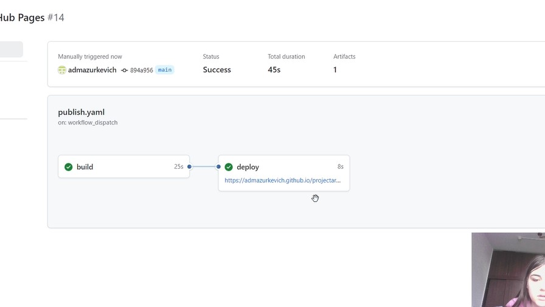
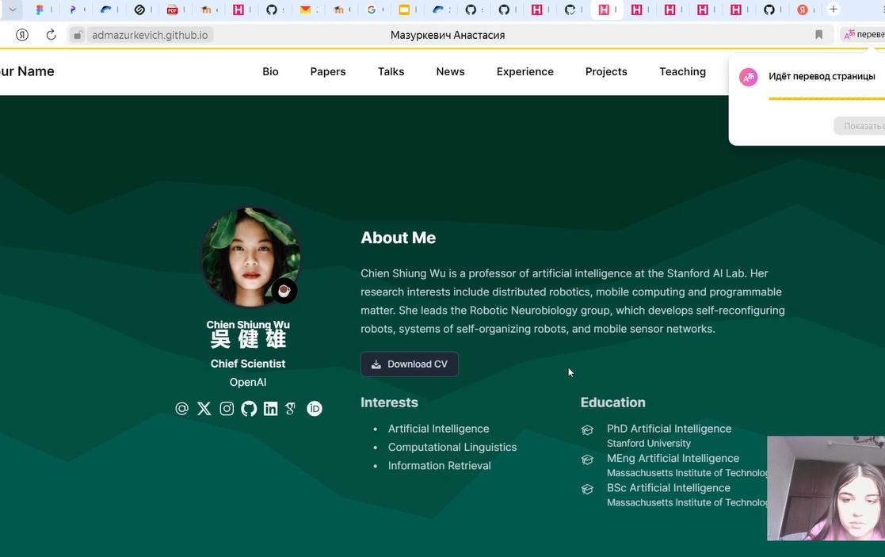

---
## Front matter
lang: ru-RU
title: Проект шаг 1
subtitle: 
author:
  - Мазуркевич А Д
institute:
  - Российский университет дружбы народов, Москва, Россия

## i18n babel
babel-lang: russian
babel-otherlangs: english

## Formatting pdf
toc: false
toc-title: Содержание
slide_level: 2
aspectratio: 169
section-titles: true
theme: metropolis
header-includes:
 - \metroset{progressbar=frametitle,sectionpage=progressbar,numbering=fraction}
---

# Информация

## Докладчик

:::::::::::::: {.columns align=center}
::: {.column width="70%"}

  * Мазуркевич АНастасия
  * студент
  * Российский университет дружбы народов

:::
::: {.column width="30%"}

:::
::::::::::::::

# Вводная часть

## Актуальность

- Создание сайтов

## Объект и предмет исследования

- Сайты из шаблонов Hugo

## Цели и задачи

- Создать шаблон сайта в гитхабе

## Материалы и методы

- терминал

# Создание презентации

## Заходим на репозиторий шаблона

## Создаем репозиторий по шаблону

## Открываем среду разработки сайта на гитхабе

## Настройка github pages

## Публикация сайта

## Сайт готов

## Открываем и проверяем сайт

